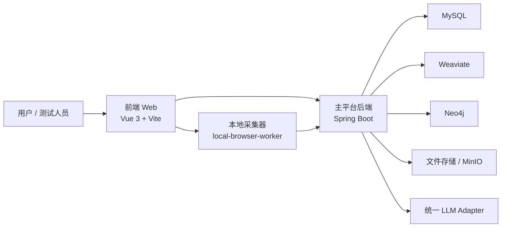

# 架构方案

## 1. 总体架构

## 2. 模块拆分

### 2.1 前端

- `frontend`
- 技术栈：Vue 3 + TypeScript + Vite
- 当前状态：
  - 登录页可用
  - 项目工作台可用
  - 轨迹页、生成页、资产页、管理页均已接入
  - UI 正在从旧样式向统一工作台样式收口

### 2.2 主平台后端

- `backend`
- 技术栈：Spring Boot 3.x + JDBC + Flyway
- 负责：
  - 认证与用户
  - 项目与权限
  - 模型配置、提示词配置
  - 生成任务
  - 轨迹接收、清洗、沉淀
  - 受控扫描任务
  - Skill / Tool / 资产管理

### 2.3 本地采集器

- `local-browser-worker`
- 技术栈：Node.js + TypeScript + Playwright Core
- 负责：
  - 本地 CLI
  - 浏览器打开
  - 身份空间隔离
  - 本地事件采集
  - 本地网络摘要采集
  - 本地服务与主平台通信

## 3. 数据层

### 3.1 MySQL

当前主库，存：

- 用户 / 项目 / 权限
- 模型配置 / 提示词
- 生成任务 / 草稿 / 正式用例
- 轨迹组 / 会话 / 事件 / 网络 / 问题片段
- Skill / Tool / 知识资产
- 受控扫描画像与任务

### 3.2 Weaviate

预留给：

- 文本向量检索
- 测试资产语义检索
- Skill / Tool / 摘要检索

### 3.3 Neo4j

预留给：

- 页面、模块、字段、流程关系
- 用例影响分析

### 3.4 MinIO / 文件存储

存：

- 截图
- trace 文件
- 导出文件
- 其他结构化中间产物

## 4. LLM 架构

统一走一套模型配置中心，不分散。

### 已有原则

1. 所有 LLM 调用走统一配置。
2. 不在业务页面直接写死供应商逻辑。
3. 提示词、输入、输出都要可追溯。

### 当前实际使用场景

- 直连测试用例生成
- 轨迹摘要
- 轨迹生成功能测试用例
- 受控扫描摘要
- Skill / Tool 提炼

## 5. 轨迹清洗与功能测试用例生成

### 当前正确链路

1. 原始事件采集
2. 页面结构快照 / 页面画像
3. 规则清洗
4. 受控语义优化
5. 功能测试用例生成

### 不采用的方案

1. 自由 Agent 直接改写轨迹
2. 逐页面硬编码规则
3. 生成 UI 自动化脚本代替功能用例

## 6. 受控扫描能力

### 目的

解决“换业务就要手工重修页面规则”的问题。

### 当前设计

1. 内置扫描源
   - 优先通过数据库中的全局 / 项目级扫描源配置扩展
   - 项目页只允许维护当前项目扫描源，全局扫描源只读展示并可被运行时复用
   - 管理列表可展示停用的项目扫描源，受控扫描运行时只加载启用源
   - 保留 `BuiltinScanSourceProvider` 作为兼容接口
   - 平台默认不内置任何业务扫描源
2. 受控扫描任务
3. 页面画像入库
4. 页面画像参与轨迹清洗与功能测试用例生成

### 规则包配置化

1. 默认 `trace-rulepacks/` 目录为空，不自动加载任何业务样例。
2. 项目级 ACTIVE 规则包和全局 ACTIVE 规则包可从 `trace_rule_pack_config` 加载。
3. 项目规则包管理页提供模板、基础结构检查和规则预览，降低新业务规则沉淀对手写 JSON 的依赖。
4. 历史 classpath JSON 规则包保留为兼容模式，不作为新业务默认接入方式。
5. 轨迹摘要、资产沉淀、修正建议等清洗链路会传入 `project_id`，优先应用项目规则包。

### 未来方向

1. 运行时自动扫描
2. 项目级页面理解器
3. 组件模式识别
4. 页面改版后自动重新学习

## 7. Playwright 新能力接入方案

### 7.1 三个能力的定位

1. `locator.normalize()`
   - 作用：把脆弱的 CSS / XPath 风格定位补强成更稳定的语义定位表达
   - 定位：轨迹定位补强能力
   - 优先级：高
2. `page.screencast`
   - 作用：替代当前以 context video / 截图为主的录屏证据链
   - 定位：主录屏能力 + 问题片段证据能力
   - 优先级：高
3. `Pick Locator`
   - 作用：开发和调试时辅助校准页面理解规则
   - 定位：开发调试工具，不进入线上主采集链路
   - 优先级：低

### 7.2 推荐接入顺序

1. 先接 `locator.normalize()`
2. 再切主录屏到 `page.screencast`
3. 最后保留 `Pick Locator` 作为开发调试能力

### 7.3 接入层级

#### local-browser-worker

负责：

1. 原始 selector 采集
2. `normalized_locator` 补强
3. `page.screencast` 开始 / 停止
4. 动作高亮、章节标记、录屏路径回传

#### backend

负责：

1. 原始字段落库
2. 清洗后步骤生成
3. `normalized_locator` 参与调试和回放辅助
4. screencast 文件纳入问题片段和轨迹资产证据链

#### frontend

负责展示：

1. 中文清洗后步骤
2. 录屏 / 问题片段
3. 需要时可展开查看 `normalized_locator`

### 7.4 建议新增字段

#### browser_trace_event

建议补：

1. `normalized_locator`
2. `section_title`
3. `dialog_title`
4. `object_label`

#### browser_trace_session

建议补：

1. `screencast_path`
2. `screencast_started_at_utc`
3. `screencast_stopped_at_utc`

#### browser_issue_clip

建议补：

1. `screencast_clip_start_ms`
2. `screencast_clip_end_ms`
3. `screencast_path`

### 7.5 收益最大的位置

1. 图标按钮不再容易退化成 `svg / use`
2. 删除 / 编辑 / 勾选动作更容易带对象名
3. 轨迹回放和问题片段证据更完整
4. 后续如需辅助生成 Playwright 调试脚本，也有更稳的定位基础

## 8. 从当前录屏切到 `page.screencast` 的改造方案

### 8.1 当前问题

当前录屏链路更偏：

1. context video 或截图补证
2. 停止录制与关闭 page / context 耦合较强
3. 对“同窗口多次开始 / 停止录制”不够自然

这与当前产品要求不完全一致，因为当前要求是：

1. 浏览器窗口尽量保留
2. 可多次开始 / 停止采集
3. 录屏与事件 / 网络 / 问题片段严格对齐

### 8.2 改造目标

1. 主录屏能力切到 `page.screencast`
2. 每次 session 开始 / 停止都独立产出一段录屏文件
3. 停止采集不关闭浏览器窗口
4. 录屏时间线与事件、网络、问题片段对齐

### 8.3 建议修改文件

#### local-browser-worker

1. `src/capture/index.ts`
   - 在 session start 时启动 `page.screencast`
   - 在 session stop 时停止 `page.screencast`
   - 增加 `showActions()` 和章节标记能力
2. `src/server/index.ts`
   - `health` 返回 screencast 能力状态
   - 会话停止后返回 `screencastPath`
3. `src/platform-api/*`
   - 补录屏文件上传协议字段

#### backend

1. 轨迹接收 DTO / Controller / Service
   - 接收 `screencastPath`
   - 归档为文件资产
2. 问题片段服务
   - 关联录屏区间和问题片段

#### frontend

1. `TracePanel.vue`
   - 展示 session 录屏
   - 展示问题片段关联录屏
2. 后续单独轨迹详情页
   - 提供时间线与录屏联动

### 8.4 与当前 start / stop 流程的兼容方式

1. 开始采集：
   - 创建 session
   - 启动 `page.screencast`
   - 继续原有事件 / 网络采集
2. 停止采集：
   - 停止 `page.screencast`
   - 保持 page 和 browser 可继续打开
   - 自动提交本轮 session 资产
3. 再次开始采集：
   - 在同一身份空间新建下一轮 session
   - 再次启动一段新的 screencast

### 8.5 多身份空间、多 page、问题片段处理

1. 多身份空间：
   - 每个 `browser_profile` 独立 session
   - 每个 session 独立 screencast 文件
2. 多 page / popup：
   - 第一阶段优先跟主 page
   - popup 出现时单独记录 page 关系
   - 后续再补多 page 聚合展示
3. 问题片段：
   - 第一阶段先记录时间区间，不做物理切片
   - 后续结合 ffmpeg 或浏览器录屏切片能力做真实截取

### 8.6 实施优先级

P0：

1. 主录屏切到 `page.screencast`
2. session 返回 `screencastPath`
3. 轨迹页可查看整段录屏

P1：

1. `showActions()` 动作高亮
2. 问题片段与录屏时间区间联动
3. 录屏文件进入资产沉淀

P2：

1. 多 page / popup 聚合
2. 物理问题片段裁剪
3. 录屏与问题倒查深度联动

## 9. 前端加载策略

1. 页面路由通过 `React.lazy` + `Suspense` 按需加载，避免工作台、项目页、管理台页面全部进入首屏主包。
2. 布局、认证上下文、全局头部保持同步加载，业务页面按路由拆分。
3. 当前 `npm run build` 已无 Vite 大 chunk warning。

## 10. business_pack 诊断与追溯

1. `business_pack_refresh_diagnostic` 记录自动沉淀链路的成功/失败、输入资产数量、生成业务包数量和推断关系数量。
2. `BusinessPackService.refreshForProject()` 与手动 `generateDrafts()` 成功路径都会写入诊断；失败路径会记录错误信息但不阻塞主链路。
3. 前端 `BusinessPacks` 展示最近刷新状态、诊断历史、来源构成和来源跳转。
4. 条目来源可跳到 TOM、页面画像、轨迹摘要/步骤模板对应模块，帮助排查业务包内容来自哪里。
